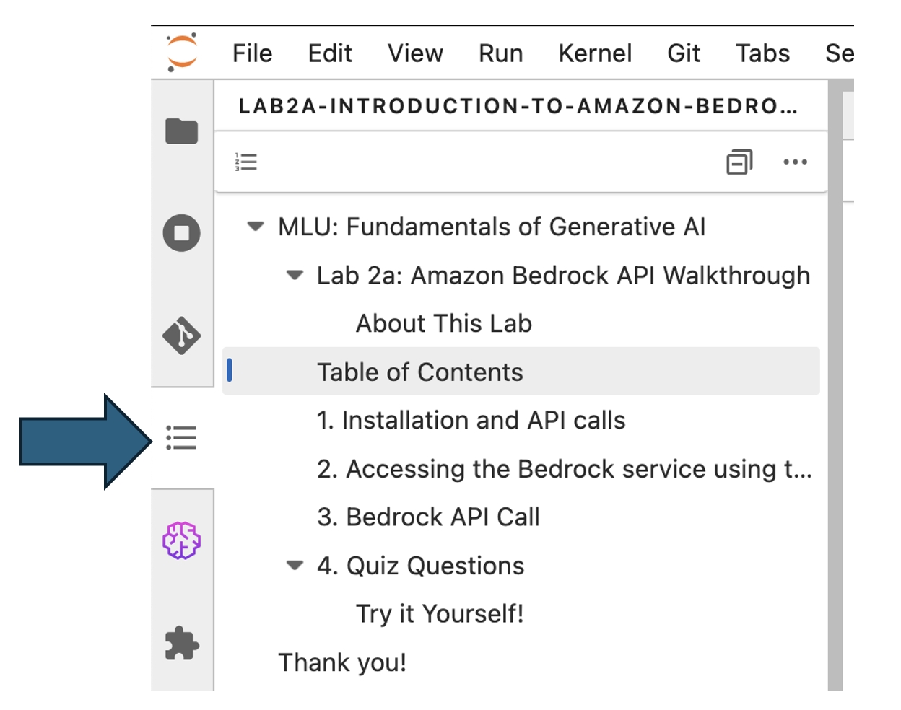

# Generative AI Learning Path
## A Comprehensive Learning Path for Generative AI with Amazon Bedrock

Welcome to our Generative AI Learning Path! This repository contains educational materials designed to help you understand and work with Generative AI technologies, with a special focus on Large Language Models (LLMs) and Amazon Bedrock.

## Content Overview

This content is structured into three comprehensive modules, each containing multiple lessons accompanied by interactive laboratory exercises in the form of Jupyter notebooks. The notebooks contain detailed instructions, explanations, and activities to reinforce theoretical concepts with practical implementation.

## Repository Structure

This material is organized into three modules:

### Module 1: Fundamentals of Generative AI
- Introduction to core concepts of generative AI
- Foundation models and LLMs
- Prompt engineering techniques
- Advanced prompting strategies
- Multimodal capabilities

### Module 2: Responsible Generative AI
- Evaluating LLMs
- Foundations of Responsible AI
- Dimensions of Responsible AI
- Improving security and safety

### Module 3: Building Applications with Foundation Models
- LangChain modules and integration
- Building chatbots
- Retrieval Augmented Generation (RAG)
- Working with agents
- Multimodal applications

Each module contains:

### 📚 Lessons
Contains instructional materials for each module:
- Detailed PowerPoint presentations
- PDF versions of presentations

### 🔬 Labs
Interactive Jupyter notebooks that include:
- Code examples and implementations
- Real-world use cases
- Challenge exercises

**Note for JupyterLab Users**: The notebook's built-in Table of Contents may not work properly in JupyterLab. You can use the Table of Contents icon in the left sidebar to navigate through the current notebook content.



Each lesson and its corresponding lab(s) are designed to be completed sequentially, building upon concepts from previous modules. All code examples are thoroughly documented and include explanatory comments to facilitate learning.

Note: Make sure to review the lesson material before attempting the associated lab exercises for the best learning experience.

## Module 1: Fundamentals of Generative AI

| Lesson                                                                                                               | Topic & Content                                                                                                   | Associated Labs                                                                                                                                                                                                                                                                               | Associated Video             |
| -------------------------------------------------------------------------------------------------------------------- | ----------------------------------------------------------------------------------------------------------------- | --------------------------------------------------------------------------------------------------------------------------------------------------------------------------------------------------------------------------------------------------------------------------------------------- | ---------------------------- |
| [**Lesson 1:** Introduction to Generative AI](Module%201%20-%20Fundamentals%20of%20Generative%20AI/Lessons/Lesson-1) | • Overview of Generative AI<br>• Key concepts and applications<br>• Current state of the technology               | [**Lab 1:**<br>Using the Bedrock console to make predictions using LLMs and other Foundation models](Module%201%20-%20Fundamentals%20of%20Generative%20AI/Labs/Lab-1)                                                                                                                         | https://youtu.be/-n3UAKECGAU |
| [**Lesson 2:** Foundation Models and LLMs](Module%201%20-%20Fundamentals%20of%20Generative%20AI/Lessons/Lesson-2)    | • Understanding foundation models<br>• Deep dive into Large Language Models<br>• Architecture and capabilities    | [**Lab 2a:**<br>Accessing Bedrock models using Boto3 for inference](Module%201%20-%20Fundamentals%20of%20Generative%20AI/Labs/Lab-2)<br><br>[**Lab 2b:**<br>Use Amazon Bedrock to build a simple conversational application](Module%201%20-%20Fundamentals%20of%20Generative%20AI/Labs/Lab-2) | https://youtu.be/irpKrYcSHoU |
| [**Lesson 3:** Prompt Engineering](Module%201%20-%20Fundamentals%20of%20Generative%20AI/Lessons/Lesson-3)            | • Basics of prompt engineering<br>• Best practices and techniques<br>• Common patterns and approaches             | [**Lab 3:**<br>Standard prompt engineering techniques](Module%201%20-%20Fundamentals%20of%20Generative%20AI/Labs/Lab-3)                                                                                                                                                                       | https://youtu.be/MAIm6X_k1X8 |
| [**Lesson 4:** Advanced Prompt Engineering](Module%201%20-%20Fundamentals%20of%20Generative%20AI/Lessons/Lesson-4)   | • Advanced prompting strategies<br>• Optimization techniques<br>• Problem-solving approaches                      | [**Lab 4a:**<br>Self consistency prompting technique](Module%201%20-%20Fundamentals%20of%20Generative%20AI/Labs/Lab-4)<br><br>[**Lab 4b:**<br>Tree-of-thought prompting technique](Module%201%20-%20Fundamentals%20of%20Generative%20AI/Labs/Lab-4)                                           | https://youtu.be/dROAuOuG9HA |
| [**Lesson 5:** Multimodal Prompting](Module%201%20-%20Fundamentals%20of%20Generative%20AI/Lessons/Lesson-5)          | • Working with multiple modalities<br>• Combining text, images, and other data types<br>• Multimodal applications | [**Lab 5:**<br>Multimodal prompting](Module%201%20-%20Fundamentals%20of%20Generative%20AI/Labs/Lab-5)                                                                                                                                                                                         | https://youtu.be/ertwcQIi0ZU |

To view all videos access the [Generative AI, Module 1: Fundamentals of Generative AI playlist](https://www.youtube.com/playlist?list=PL8P_Z6C4GcuUaUEwqUGv9dEpfzmWSE05A).

## Module 2: Responsible Generative AI

| Lesson                                                                                                         | Topic & Content                                                                          | Associated Labs                                                                                                                                                                                                                                                                                                  | Associated Video |
| -------------------------------------------------------------------------------------------------------------- | ---------------------------------------------------------------------------------------- | ---------------------------------------------------------------------------------------------------------------------------------------------------------------------------------------------------------------------------------------------------------------------------------------------------------------- | ---------------- |
| [**Lesson 1:** Evaluating LLMs](Module%202%20-%20Responsible%20Generative%20AI/Lessons/Lesson-1)               | • Evaluation frameworks<br>• Metrics and benchmarks<br>• Performance assessment          | No lab for this lesson                                                                                                                                                                                                                                                                                           | [https://youtu.be/8togqsH1xRU](https://youtu.be/8togqsH1xRU)      |
| [**Lesson 2:** Foundations of Responsible AI](Module%202%20-%20Responsible%20Generative%20AI/Lessons/Lesson-2) | • Ethical considerations in AI<br>• Responsible AI principles<br>• Governance frameworks | [**Lab 2:**<br>Data protection techniques](Module%202%20-%20Responsible%20Generative%20AI/Labs/Lab-2)                                                                                                                                                                                                            | [https://youtu.be/cUEdNmnKJVQ](https://youtu.be/cUEdNmnKJVQ)      |
| [**Lesson 3:** Dimensions of Responsible AI](Module%202%20-%20Responsible%20Generative%20AI/Lessons/Lesson-3)  | • Building robust AI systems<br>• Testing and validation<br>• Handling edge cases        | [**Lab 3:**<br>Implementing robustness in AI applications](Module%202%20-%20Responsible%20Generative%20AI/Labs/Lab-3)                                                                                                                                                                                            | [https://youtu.be/Wdbq6vpdNKI](https://youtu.be/Wdbq6vpdNKI)      |
| [**Lesson 4:** Improving security and safety](Module%202%20-%20Responsible%20Generative%20AI/Lessons/Lesson-4) | • Jailbreak prevention<br>• Watermarking<br>• Debiasing strategies                       | [**Lab 4a:**<br>Jailbreak prevention](Module%202%20-%20Responsible%20Generative%20AI/Labs/Lab-4)<br><br>[**Lab 4b:**<br>Watermarking techniques](Module%202%20-%20Responsible%20Generative%20AI/Labs/Lab-4)<br><br>[**Lab 4c:**<br>Debiasing methods](Module%202%20-%20Responsible%20Generative%20AI/Labs/Lab-4) | [https://youtu.be/Ordl9VfDCOE](https://youtu.be/Ordl9VfDCOE)      |

To view all videos access the [Generative AI, Module 2: Responsible Generative AI playlist](https://www.youtube.com/watch?v=8togqsH1xRU&list=PL8P_Z6C4GcuUZZTjZbvdGm1o5ChzSKIKo).

## Module 3: Building Applications with Foundation Models

| Lesson                                                                                                                                         | Topic & Content                                                                             | Associated Labs                                                                                                                                                                                                                                                                                                                                                                     | Associated Video |
| ---------------------------------------------------------------------------------------------------------------------------------------------- | ------------------------------------------------------------------------------------------- | ----------------------------------------------------------------------------------------------------------------------------------------------------------------------------------------------------------------------------------------------------------------------------------------------------------------------------------------------------------------------------------- | ---------------- |
| [**Lesson 1:** LangChain Modules](Module%203%20-%20Building%20Applications%20with%20Foundation%20Models/Lessons/Lesson-1)                      | • LangChain framework overview<br>• Core components and modules<br>• Integration patterns   | [**Lab 1:**<br>Working with LangChain modules](Module%203%20-%20Building%20Applications%20with%20Foundation%20Models/Labs/Lab-1)                                                                                                                                                                                                                                                    | [https://youtu.be/0dLiVlWQhYU](https://youtu.be/0dLiVlWQhYU)      |
| [**Lesson 2:** Developing conversational applications](Module%203%20-%20Building%20Applications%20with%20Foundation%20Models/Lessons/Lesson-2) | • Chatbot architecture<br>• Conversation design<br>• State management                       | [**Lab 2:**<br>Building interactive chatbots](Module%203%20-%20Building%20Applications%20with%20Foundation%20Models/Labs/Lab-2)                                                                                                                                                                                                                                                     | [https://youtu.be/cRRHnECSYEc](https://youtu.be/cRRHnECSYEc)      |
| [**Lesson 3:** RAG](Module%203%20-%20Building%20Applications%20with%20Foundation%20Models/Lessons/Lesson-3)                                    | • RAG architecture and components<br>• Vector databases<br>• Knowledge retrieval techniques | [**Lab 3a:**<br>Retrieval Augmented Generation](Module%203%20-%20Building%20Applications%20with%20Foundation%20Models/Labs/Lab-3)<br><br>[**Lab 3b:**<br>Multimodal RAG](Module%203%20-%20Building%20Applications%20with%20Foundation%20Models/Labs/Lab-3)                                                                                                                          | [https://youtu.be/5H77KxUbQnA](https://youtu.be/5H77KxUbQnA)      |
| [**Lesson 4:** Agents](Module%203%20-%20Building%20Applications%20with%20Foundation%20Models/Lessons/Lesson-4)                                 | • Agent architecture<br>• Tools and capabilities<br>• Orchestration patterns                | [**Lab 4:**<br>Building AI agents](Module%203%20-%20Building%20Applications%20with%20Foundation%20Models/Labs/Lab-4)                                                                                                                                                                                                                                                                | [https://youtu.be/KGbplvULNwg](https://youtu.be/KGbplvULNwg)      |
| [**Lesson 5:** Multimodal Applications](Module%203%20-%20Building%20Applications%20with%20Foundation%20Models/Lessons/Lesson-5)                | • Personalization strategies<br>• Troubleshooting methods<br>• Multimodal agent development | [**Lab 5a:**<br>Personalization](Module%203%20-%20Building%20Applications%20with%20Foundation%20Models/Labs/Lab-5)<br><br>[**Lab 5b:**<br>Troubleshooting techniques](Module%203%20-%20Building%20Applications%20with%20Foundation%20Models/Labs/Lab-5)<br><br>[**Lab 5c:**<br>Multimodal agents](Module%203%20-%20Building%20Applications%20with%20Foundation%20Models/Labs/Lab-5) | [https://youtu.be/_QIbfQcFGv0](https://youtu.be/_QIbfQcFGv0)      |

To view all videos access the [Generative AI, Module 3: Building Applications with Foundation Models playlist](https://www.youtube.com/playlist?list=PL8P_Z6C4GcuVAMUJicQ8MvxsF3khz7E2_).

## Prerequisites

To get the most out of this content, you should have:
- Basic understanding of Python programming
- AWS account with appropriate permissions
- Familiarity with Jupyter notebooks
- Basic understanding of machine learning concepts
- Familiarity with basic Natural Language Processing (NLP) techniques
- Familiarity with basic Computer Vision (CV) topics
- [OPTIONAL] Familiarity with Amazon Bedrock

## Getting Started

1. Clone this repository:
```bash
git clone [repository-url]
```

2. Environment Requirements:
- Python 3.10+
- Jupyter Notebook environment
- AWS CLI configured with appropriate credentials
- Amazon Bedrock access
- Required Python packages (specified within the notebooks)

3. Start Learning:
- Begin with the presentation materials in the Lessons folder
- Follow along with the corresponding lab notebooks
- Each notebook is self-contained with all necessary instructions and explanations

**Note**: The Jupyter notebooks will run anywhere you have Jupyter correctly configured, however the notebooks in this repo are designed to run on Amazon SageMaker using the `conda_python3` kernel.

## Additional Resources

- [Amazon Bedrock Documentation](https://docs.aws.amazon.com/bedrock/)
- [AWS Machine Learning Blog](https://aws.amazon.com/blogs/machine-learning/)

## Support

If you need help or have questions:
- Open an issue in this repository

## License

This material is licensed under the terms specified in the [LICENSE](LICENSE) file.

## Contributing
If you have questions, comments, suggestions, etc. please feel free to cut tickets in this repo.

Also, please refer to the [CONTRIBUTING](CONTRIBUTING.md) document for further details on contributing to this repository.

---

We hope you enjoy learning about Generative AI! Happy learning! 🚀
